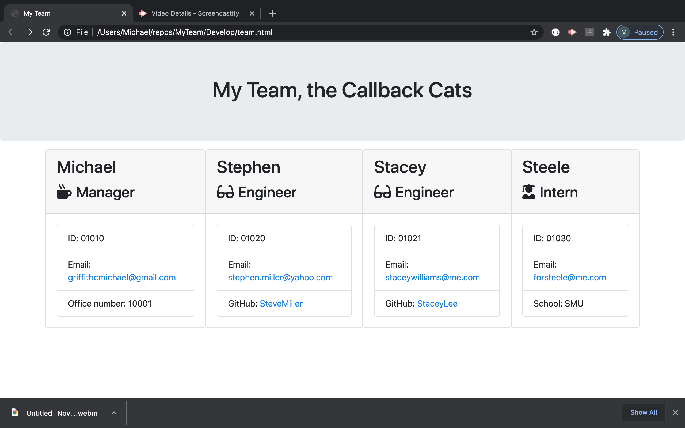
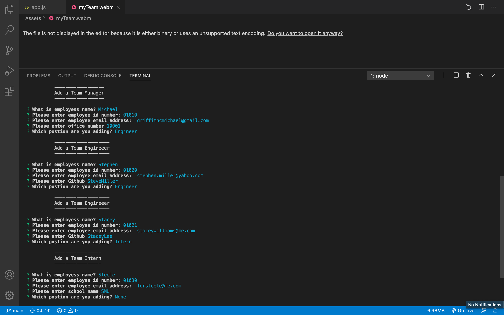

  <h1 align="center">Who's Team, My Team</h1>
    
    
## Description
   A quick and easy way for a Manager to keep track of important information at their finger tips.
    
     
    
## Table Of Contents
  - [Description](#discriptionOfProject)
  - [Installation](#installationOfProject)
  - [Usage](#usageOfProject)
  - [License](#licenseOfProject)
  - [Test](#testOfProject)
  - [Issues](#issuesOfProject)
  - [Contributors](#contributorsOfProject)
    
    
    
## Installation
  I installed inquirer to produce this.
    
## Usage
  Stream line employees information that is relevant to anyone working on a team together.
    
## License
  MIT
    
  This application is covered by the MIT license.
    
## Test
  Yes, test for proper written classes and inline classes.
    
## Issues
  N/A
    
## Contributors
  Just myself, Michael Griffith
    
## Github
  GriffMike167
    
## Email
  griffithcmichael@gmail.com
  